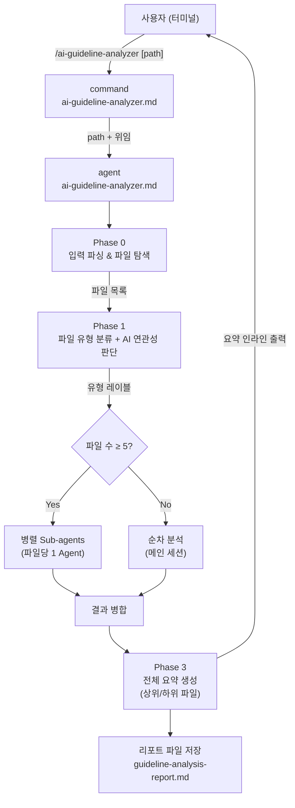
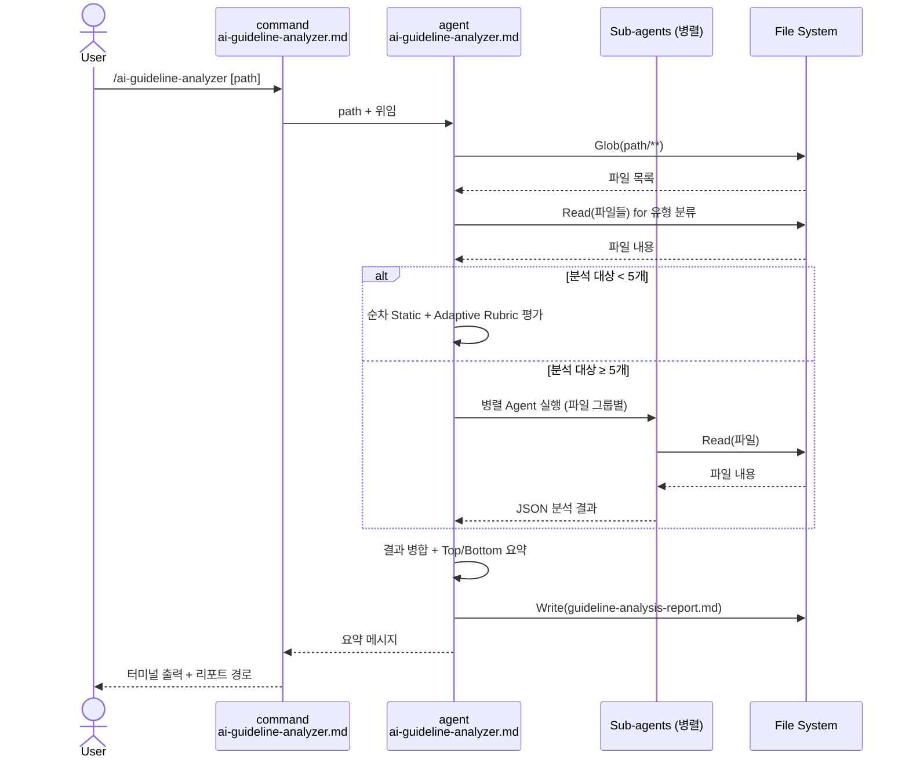

# AI Guideline Analyzer — Design Document

| Item | Content |
|------|---------|
| **Version** | v1.0 |
| **Date** | 2026-03-31 |
| **Author** | software-develop-architect agent |
| **Mode** | feature |
| **Output Path** | `.claude/specs/ai-guideline-analyzer/design.md` |

---

## 1. Project Overview

### 1.1 Purpose

Claude Code 프로젝트 내 AI 지침 파일(agent, command, hook, skill, CLAUDE.md, eval, config 등)의 품질을 자동 분석하는 agent 및 command를 추가한다.
분석 결과로 각 파일의 잘된 점, 아쉬운 점, 개선 방향을 제공하여 지침 파일 품질을 지속적으로 개선할 수 있게 한다.

### 1.2 Scope

- **대상**: `.claude/` 디렉토리 내 AI 지침 역할을 수행하는 파일 전체
- **분석 방법**: Static Rubric(공통 8항목) + Adaptive Rubric(파일 종류별 동적 생성)
- **산출물**: 파일별 상세 분석 + 전체 요약 리포트 (Markdown 파일)

### 1.3 용어 정의

| 용어 | 정의 |
|------|------|
| AI 지침 파일 | AI agent의 행동, 역할, 규칙을 정의하는 파일 |
| Static Rubric | 모든 파일 유형에 공통 적용되는 8개 평가 항목 |
| Adaptive Rubric | 파일 유형(agent/command/hook/skill 등)에 따라 동적으로 생성되는 평가 항목 |
| 파일 유형 분류 | agent가 파일 내용을 읽고 스스로 판단하는 파일 역할 분류 |
| 임계값 N | 병렬 처리 전환 기준 파일 수 (= 5개) |

---

## 2. Stakeholders and Roles

| Stakeholder | Role | Responsibility |
|------------|------|----------------|
| 개발자/운영자 | 사용자 | `/ai-guideline-analyzer` 커맨드 실행, 분석 결과 활용 |
| ai-guideline-analyzer command | 오케스트레이터 | 입력 파싱, agent 위임 |
| ai-guideline-analyzer agent | 분석 엔진 | 파일 탐색, 유형 분류, rubric 평가, 리포트 생성 |
| 분석 대상 파일 | 피분석 객체 | agent/command/hook/skill/eval/config/CLAUDE.md 등 |

---

## 3. Scope Boundary

- 이 시스템은 **AI 지침 파일 분석만** 수행한다. 코드 수정/개선은 하지 않는다.
- 분석 경로 외부 파일은 탐색하지 않는다 (기본값: `.claude/`).
- 순수 비즈니스 로직 코드(Java/Python/JS 구현 파일)는 AI agent 연관성이 없을 경우 분석 대상에서 제외한다.
- 자동 수정(auto-fix) 기능은 포함하지 않는다.
- CI/CD 파이프라인 연동은 포함하지 않는다.

---

## 4. Requirements Definition

### 4.1 Functional Requirements

| ID | 요구사항 | 우선순위 |
|----|---------|---------|
| FR-01 | 사용자가 분석 경로(옵션)를 입력하면 해당 경로 아래 AI 지침 파일을 탐색한다. 경로 미지정 시 `.claude/` 기본 적용 | P1 |
| FR-02 | 탐색된 각 파일의 내용을 읽고, 역할 기반으로 파일 유형(agent/command/hook/skill/eval/config/CLAUDE.md/기타)을 분류한다 | P1 |
| FR-03 | AI 지침/행동 정의와 무관한 파일(순수 비즈니스 로직)은 분석 대상에서 제외한다 | P1 |
| FR-04 | Static Rubric(S1~S8) 8항목을 모든 파일에 적용하여 점수(예/아니오 또는 1-5점)와 근거를 출력한다 | P1 |
| FR-05 | 파일 유형에 맞는 Adaptive Rubric 항목을 파일 내용 기반으로 동적 생성하여 평가한다 | P1 |
| FR-06 | 파일별로 "잘된 점 / 아쉬운 점 / 개선 제안"을 포함한 종합 판정을 생성한다 | P1 |
| FR-07 | 전체 분석 완료 후 점수 상위 파일(왜 잘 만들었는지 구성 분석)과 하위 파일(개선 우선순위)을 요약한다 | P1 |
| FR-08 | 분석 리포트를 Markdown 파일로 저장한다 | P1 |
| FR-09 | 분석 대상 파일이 5개 이상인 경우 병렬 Sub-agent로 분석하여 속도를 높인다 | P2 |
| FR-10 | 파일 유형 판단이 불확실할 경우 파일 내용을 읽어 AI agent 연관성을 재확인한다 | P1 |

### 4.2 Non-functional Requirements

| ID | 요구사항 |
|----|---------|
| NFR-01 | **일관성**: 기존 `.claude/agents/`, `.claude/commands/` 파일 구조 및 frontmatter 컨벤션을 따른다 |
| NFR-02 | **재현성**: 동일 파일, 동일 rubric에 대해 동일한 평가 결과를 생성한다 (주관적 판단 최소화) |
| NFR-03 | **확장성**: 새로운 파일 유형이 추가되어도 Adaptive Rubric 생성 로직으로 대응 가능하다 |
| NFR-04 | **출력 언어**: 리포트 본문은 한국어로 작성한다 (CLAUDE.md 규정 준수) |

---

## 5. System Architecture



---

## 6. Current System Analysis (As-Is)

### 6.1 기존 AI 지침 파일 구조

```
.claude/
├── agents/          # agent 파일 (.md, frontmatter 포함)
├── commands/        # 슬래시 커맨드 파일 (.md)
├── hooks/           # PreToolUse/PostToolUse 훅 (.js)
├── skills/          # 스킬 (SKILL.md + 참조 파일)
├── evals/           # 평가 케이스 (.json)
├── scripts/         # 보조 스크립트 (.js, .py)
├── settings.json    # 권한/훅 설정
├── workflow-rules.md # 공통 워크플로우 규칙
└── CLAUDE.md        # 프로젝트 전역 지침
```

### 6.2 기존 파일 컨벤션

**Agent 파일 frontmatter 형식:**
```yaml
---
name: {agent-name}
description: >
  {설명, 트리거 조건 포함}
model: opus | sonnet | haiku
tools: Read, Grep, Glob, ...
---
```

**Command 파일 형식:**
```markdown
---
description: "한 줄 설명"
---

Input: $ARGUMENTS

## Execution
...
```

**Skill 파일 형식 (SKILL.md):**
```yaml
---
name: {skill-name}
description: {트리거 조건 포함}
---
# {Skill Title}
## Input / Phase N / Output
```

---

## 7. Target System Design (To-Be)

### 7.1 추가 파일

| 파일 | 역할 |
|------|------|
| `.claude/commands/ai-guideline-analyzer.md` | 사용자 진입점 커맨드 |
| `.claude/agents/ai-guideline-analyzer.md` | 분석 로직 전담 agent |

---

## 8. Component Design

### 8.1 Component A: Command (`ai-guideline-analyzer.md`)

**파일 위치**: `.claude/commands/ai-guideline-analyzer.md`

**책임**: 사용자 입력 파싱 후 agent에게 위임. 직접 분석 로직 수행 금지.

**입력 파싱 규칙**:
| 입력 형태 | 처리 |
|----------|------|
| `/ai-guideline-analyzer` (인자 없음) | 기본 경로 `.claude/` 사용 |
| `/ai-guideline-analyzer .claude/agents` | 지정 경로 사용 |
| `/ai-guideline-analyzer --output path/to/report.md` | 출력 경로 지정 |

**위임 형식**:
```
Use agent ai-guideline-analyzer to analyze AI guideline files.
Input path: {resolved_path}
Output path: {output_path}
```

**FR-01 연결**

---

### 8.2 Component B: Agent (`ai-guideline-analyzer.md`)

**파일 위치**: `.claude/agents/ai-guideline-analyzer.md`

**Tools**: Read, Grep, Glob, Bash, Agent

**5-Phase 실행 구조**:


#### Phase 0 — 파일 탐색 (FR-01, FR-03)

1. Glob으로 입력 경로 하위 모든 파일 탐색
2. 다음 파일 즉시 제외 (유형 판별 불필요):
   - `.gitkeep`, `.gitignore`, 바이너리 파일
   - `*.log`, `*.zip`, `*.png`, `*.jpg` 등 미디어/아카이브
   - `node_modules/`, `.git/` 하위
3. 나머지 파일은 Phase 1로 전달

#### Phase 1 — 파일 유형 분류 (FR-02, FR-03, FR-10)

각 파일에 대해:

**Step 1: 경로 기반 1차 분류**
```
경로 포함 패턴          → 추정 유형
.claude/agents/*.md     → agent
.claude/commands/*.md   → command
.claude/hooks/*.js      → hook
.claude/skills/**/SKILL.md → skill
.claude/evals/**/*.json → eval
settings.json           → config
CLAUDE.md              → CLAUDE.md
workflow-rules.md       → workflow-rules
.claude/scripts/*.js    → script
.claude/scripts/*.py    → script
```

**Step 2: 내용 기반 확인 (ambiguous 케이스)**
- 경로 매칭 불가 파일 → 파일 내용 Read
- AI agent 연관성 판단 기준:
  - frontmatter에 `name:`, `description:`, `model:`, `tools:` 포함 → agent/command
  - `Phase N —` 구조 + AI 행동 지시문 포함 → agent/command
  - `process.stdin`/JSON 파싱 + `process.exit()` 패턴 → hook
  - 순수 로직 코드 (비즈니스 로직 함수만, AI 지시 없음) → **분석 제외**
- 판단 불가 시: `> 💡 [Assumption] {파일명}: 판단 불가, 분석 제외`로 기록

**FR-02, FR-03, FR-10 연결**

#### Phase 2 — 분석 실행 (FR-04, FR-05, FR-06, FR-09)

**파일 수에 따른 실행 방식 결정**:
| 조건 | 실행 방식 |
|------|----------|
| 분석 대상 < 5개 | 메인 세션에서 순차 분석 |
| 분석 대상 ≥ 5개 | 병렬 Sub-agents (파일당 1 Agent) |

**병렬 Sub-agent 프롬프트 형식**:
```
You are an AI guideline file analyst. Analyze the following file and return structured results.

File path: {file_path}
File type: {classified_type}

Task:
1. Read the file using the Read tool
2. Apply Static Rubric (S1-S8) as defined below
3. Generate and apply Adaptive Rubric based on file type
4. Return results in the exact JSON format specified

[Static Rubric Definition]
...

[Output JSON Format]
{
  "file": "{path}",
  "type": "{type}",
  "static_scores": { "S1": {...}, ..., "S8": {...} },
  "adaptive_rubric": [ {"id": "A1", "item": "...", "score": "Y/N or 1-5", "reason": "..."} ],
  "summary": { "pros": ["..."], "cons": ["..."], "suggestions": ["..."] },
  "total_score": 0.0
}
```

**Static Rubric 평가 기준** (FR-04 연결):

| ID | 항목 | 판단 방식 | 측정 기준 |
|----|------|---------|---------|
| S1 | 역할/목적이 한 줄로 명확히 정의되어 있는가? | 예/아니오 | frontmatter `description` 또는 첫 H1/H2 섹션에 단일 목적 문장 존재 여부 |
| S2 | 트리거 조건이 명시되어 있는가? | 예/아니오 | "when", "트리거", "사용 시", "TRIGGER when", "Use when", "사용하는 경우" 등 키워드 포함 여부 |
| S3 | 출력 형식이 명시적으로 정의되어 있는가? | 예/아니오 | "Output", "출력", 코드 블록 내 형식 예시, 파일명/경로 명시 여부 |
| S4 | 자체 검증 메커니즘이 있는가? | 예/아니오 | `- [ ]` 체크리스트 또는 `| # | Check Item |` 형태 테이블 존재 여부 |
| S5 | 사람 확인/개입 지점이 명확히 설계되어 있는가? | 예/아니오 | "CHECKPOINT", "사용자 승인", "confirm", "AskUserQuestion" 등 키워드 존재 여부 |
| S6 | 불확실할 때 행동 규칙이 있는가? | 예/아니오 | "불확실", "판단 불가", "assume", "Review Needed", "fallback" 등 불확실 처리 키워드 존재 여부 |
| S7 | 파일 길이가 적절한가? | 1-5점 | 100줄 이하=5, 101-200=4, 201-300=3, 301-400=2, 401줄 이상=1 |
| S8 | 지침이 구체적이고 측정 가능한가? | 1-5점 | 모호 표현 비율 기반: "충분히/적절히/잘/좋은/일반적으로" 등 5개 이상=1, 3-4개=2, 2개=3, 1개=4, 0개=5 |

**Adaptive Rubric 생성 지침** (FR-05 연결):

파일 유형 판별 후 해당 유형에 맞는 3-5개 항목을 동적으로 생성한다:

| 유형 | 생성 기준 예시 |
|------|--------------|
| agent | Phase 구조 존재 여부, 실패/오류 처리 있는가, Self-Verification 있는가 |
| command | 입력 파싱 명확성, 실행 순서/절차 있는가, 다른 agent 위임 여부 |
| hook | 트리거 매처 명확성, 부작용 통제(exit code 사용), 파싱 실패 처리 |
| skill | Phase 구조 있는가, 입출력 경로 고정 여부, 에러 처리 있는가 |
| eval | 입력/기대출력 명확 정의, ID 고유성, target 필드 존재 |
| config | 권한 범위 최소화, 훅 설정의 명확성 |
| CLAUDE.md | 전체 프로젝트에 universally applicable한가, progressive disclosure 구조 |
| workflow-rules | 단계 순서 명확성, checkpoint 설계, 역할 분리 원칙 존재 |

> ⚠️ [Review Needed] Adaptive Rubric 항목은 agent가 파일 내용을 직접 읽고 생성하므로, 동일 파일 유형이라도 내용에 따라 항목이 달라질 수 있다. 평가 항목은 분석 리포트에 명시적으로 기록하여 투명성을 확보해야 한다.

**점수 계산**:
```
S1~S6: 예=1점, 아니오=0점 (합산 최대 6점)
S7, S8: 1-5점 스케일 (합산 최대 10점)
Static 총점 = (S1~S6 합산 / 6 × 50) + (S7+S8 / 10 × 30) = 최대 80점

Adaptive: 항목당 최대 5점, 항목 수로 정규화 → 최대 20점

Total Score = Static (80점 만점) + Adaptive (20점 만점) = 100점 만점
```

**파일별 종합 판정 형식** (FR-06 연결):
```markdown
### {파일 경로}
**유형**: {분류된 파일 유형}
**Total Score**: {N}/100

#### Static Rubric
| ID | 항목 | 점수 | 근거 |
|----|------|------|------|
| S1 | ... | Y/N | ... |
...

#### Adaptive Rubric ({유형}용)
| ID | 항목 | 점수 | 근거 |
|----|------|------|------|
| A1 | ... | Y/N | ... |
...

#### 종합 판정
- **잘된 점**: ...
- **아쉬운 점**: ...
- **개선 제안**: ...
```

#### Phase 3 — 요약 생성 (FR-07)

모든 파일 분석 완료 후:

1. Total Score 기준 정렬
2. **상위 파일** (Top 3, 또는 Score 75점 이상):
   - 왜 잘 만들었는지 구성 요소 분석 (어떤 항목이 모범적인가)
3. **하위 파일** (Bottom 3, 또는 Score 50점 미만):
   - 우선순위 개선 제안 (가장 중요한 보완점 2-3가지)

**FR-07 연결**

#### Phase 4 — 리포트 저장 (FR-08)

- 저장 경로: 사용자 지정 없을 시 `{input_path}/guideline-analysis-report.md`
- 파일명 고정: `guideline-analysis-report.md`
- 저장 후 터미널에 요약(분석 파일 수, 평균 점수, 최고/최저 파일) 인라인 출력

---

## 9. Interface Design (CLI)

### 9.1 커맨드 사용법

```bash
# 기본 (기본값: .claude/ 전체 분석)
/ai-guideline-analyzer

# 경로 지정
/ai-guideline-analyzer .claude/agents

# 출력 경로 지정
/ai-guideline-analyzer .claude/ --output reports/guideline-analysis.md

# 특정 파일
/ai-guideline-analyzer .claude/agents/code-reviewer.md
```

### 9.2 터미널 출력 형식

**분석 시작 시**:
```
AI Guideline Analyzer 시작
분석 경로: {path}
발견된 파일: {N}개 (AI 지침 파일: {M}개, 제외: {K}개)
분석 방식: {순차 / 병렬 Sub-agents}
```

**분석 완료 후**:
```
분석 완료
분석된 파일: {M}개
평균 점수: {avg}/100
최고 점수: {file} ({score}/100)
최저 점수: {file} ({score}/100)

리포트 저장: {output_path}
```

---

## 10. Development Phases and Priorities

### Phase 1 (필수 핵심 기능)

| 항목 | 완료 기준 (SMART) |
|------|-----------------|
| Command 파일 작성 | `/ai-guideline-analyzer` 실행 시 경로 파싱 후 agent에게 위임하고, 결과 요약을 터미널에 출력한다. 확인 방법: 커맨드 직접 실행 |
| Agent Phase 0-1 구현 | `.claude/` 경로 탐색 시 AI 지침 파일 정확히 식별하고 유형 분류. 확인 방법: 기존 agents/commands/hooks/skills/evals 각 1개씩 정확히 분류되는지 검증 |
| Static Rubric S1-S8 구현 | 임의 agent 파일 1개에 S1-S8 평가 적용 시, 각 항목에 Y/N 또는 1-5점 점수와 근거 텍스트가 모두 출력됨 |
| Adaptive Rubric 구현 | agent/command/hook/skill 4가지 유형에 대해 각 3개 이상의 유형별 항목이 동적 생성됨 |
| 리포트 파일 저장 | 분석 완료 후 `guideline-analysis-report.md`가 지정 경로에 저장되고, 파일 내 모든 분석 파일에 대한 점수와 종합 판정이 포함됨 |

### Phase 2 (성능 최적화)

| 항목 | 완료 기준 (SMART) |
|------|-----------------|
| 병렬 Sub-agent 처리 | 분석 대상 5개 이상 시 병렬 실행. 확인 방법: .claude/ 전체 분석 시 5개 이상 탐색되면 `병렬 Sub-agents` 방식으로 출력됨 |
| 전체 요약 (Top/Bottom) | 분석 완료 후 리포트 말미에 Score 기준 Top 3, Bottom 3 파일과 구성 분석/개선 우선순위가 포함됨 |

---

## 11. Risks and Constraints

| Risk | 가능성 | 영향 | 대응 |
|------|--------|------|------|
| 파일 유형 분류 오판 | 중 | 낮음 | `> 💡 [Assumption]` 표기 후 분석 제외, 리포트에 기록 |
| 병렬 Sub-agent context 비용 증가 | 낮음 | 중 | 임계값 5개로 제한, 파일당 1 Agent가 아닌 배치 그룹핑 고려 가능 (v2 개선사항) |
| Adaptive Rubric 항목 비일관성 | 중 | 낮음 | 유형별 최소/최대 항목 수 명시 (3-5개), 리포트에 생성된 항목 명시 |
| 300줄 초과 파일 분석 속도 | 낮음 | 낮음 | Read tool limit 파라미터 활용, Phase 1 분류에만 상위 50줄 사용 가능 |

> ⚠️ [Review Needed] 병렬 Sub-agent 수가 과도하게 많을 경우 (20개 이상) API rate limit 또는 context 비용 문제가 발생할 수 있다. 초기 구현에서는 배치 크기를 5개로 제한하는 방안을 검토해야 한다.

---

## 12. Mermaid: 데이터 흐름



---

## 13. Self-Verification

| # | 체크 항목 | 결과 |
|---|-----------|------|
| 1 | 완료 기준이 모두 측정 가능한가? | ✅ SMART 형식으로 작성됨 |
| 2 | 참조된 파일이 실제 존재하는가? | ✅ `.claude/agents/`, `.claude/commands/` 등 모두 확인됨 |
| 3 | 기존 코드와 충돌 가능성 검토 | ✅ 신규 파일 2개 추가만, 기존 파일 수정 없음 |
| 4 | 인터페이스 정의가 구현 시작에 충분한가? | ✅ 커맨드 형식, agent frontmatter, Phase별 로직 명시됨 |
| 5 | 누락된 예외 케이스 | ✅ 경로 없음/단일 파일/판단 불가 케이스 모두 처리됨 |
| 6 | FR/NFR 태그 연결 | ✅ 각 컴포넌트/항목에 FR-XX 태그 기재됨 |
| 7 | Mermaid 다이어그램 포함 | ✅ 시스템 아키텍처 + 시퀀스 다이어그램 2개 포함 |
