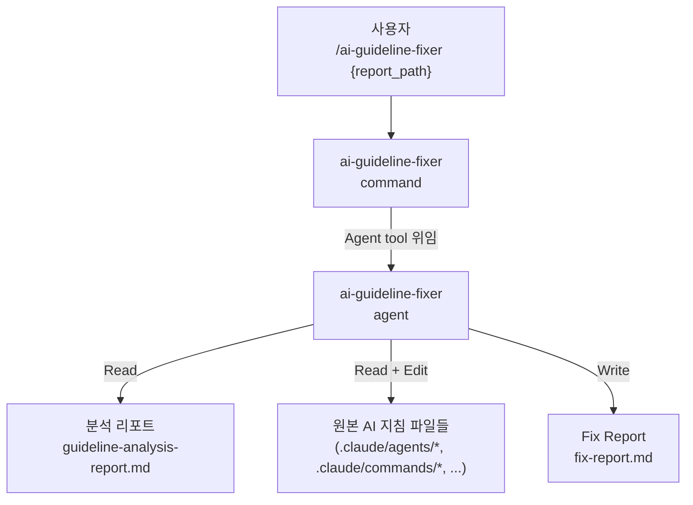

# AI Guideline Fixer — Design Document

| Item | Content |
|------|---------|
| **Version** | v1.0 |
| **Date** | 2026-04-01 |
| **Author** | software-develop-architect agent |
| **Mode** | feature |
| **Output Path** | `.claude/specs/ai-guideline-fixer/design.md` |

---

## 1. Project Overview

### 1.1 Purpose

`ai-guideline-analyzer`가 생성한 분석 결과 Markdown 파일을 입력으로 받아, 지적된 문제점을 원본 AI 지침 파일에 직접 수정·반영하는 command와 agent를 추가한다.
수정은 분석 결과에서 명시된 범위에 한정하며, 수정 완료 후 무엇을 고쳤는지와 고치지 못한 항목의 이유를 담은 Fix Report를 저장한다.

### 1.2 Scope

- **입력**: `ai-guideline-analyzer` agent가 저장한 분석 결과 Markdown 파일 1개 (경로 지정)
- **수정 대상**: 리포트에서 점수가 기록된 AI 지침 파일들 (agent / command / hook / skill 등)
- **수정 범위**: 분석 결과에서 N 또는 저점으로 기록된 Static/Adaptive rubric 항목에 한정
- **산출물**: 수정된 원본 파일들 + Fix Report (Markdown)

### 1.3 용어 정의

| 용어 | 정의 |
|------|------|
| 분석 리포트 | `ai-guideline-analyzer`가 생성한 `guideline-analysis-report.md` |
| Fix 대상 항목 | 분석 리포트에서 S1–S8 중 N이거나 S7/S8이 3점 미만인 항목, Adaptive 항목 중 N인 항목 |
| In-scope 수정 | 안전하게 자동 수정 가능한 항목 (섹션 추가, 표현 교체 등) |
| Out-of-scope 수정 | 구조적 판단이 필요하거나 자동화 시 부작용 위험이 큰 항목 |
| Fix Report | 수정 완료/미완료 항목을 정리한 결과 Markdown 파일 |

---

## 2. Stakeholders and Roles

| Stakeholder | Role | Responsibility |
|-------------|------|----------------|
| 개발자/운영자 | 사용자 | `/ai-guideline-fixer` 실행, Fix Report 검토 후 최종 확인 |
| ai-guideline-fixer command | 오케스트레이터 | 입력 파싱, agent 위임 |
| ai-guideline-fixer agent | 수정 실행 엔진 | 리포트 파싱, 우선순위 정렬, 파일 수정, Fix Report 저장 |
| 원본 AI 지침 파일 | 수정 대상 | agent / command / hook / skill 등 지침 파일 |
| git | 변경 이력 관리 | 원본 백업 역할 (agent가 별도 백업 불필요) |

---

## 3. Scope Boundary

- 이 시스템은 **분석 리포트에 기록된 문제점만** 수정한다. 리포트에 없는 내용은 수정하지 않는다.
- 파일 길이 단축(S7 개선)은 수행하지 않는다 — 구조적 재구성이 필요하여 범위 초과.
- 사람 확인/개입 지점 삽입(S5 개선)은 수행하지 않는다 — 삽입 위치 판단에 도메인 맥락이 필요.
- 분석 리포트 파일 자체는 수정하지 않는다.
- CI/CD 연동 및 자동 커밋은 포함하지 않는다.
- 수정 근거를 파일 내 주석 또는 변경 로그로 남기지 않는다 (파일 오염 방지).

---

## 4. Requirements Definition

### 4.1 Functional Requirements

| ID | 요구사항 | 우선순위 |
|----|---------|---------|
| FR-01 | command가 `$ARGUMENTS`에서 분석 리포트 경로와 출력 경로(선택)를 파싱하여 agent에 전달한다 | Must |
| FR-02 | agent가 분석 리포트 Markdown을 읽어 파일별 점수와 문제 항목을 추출한다 | Must |
| FR-03 | 추출된 파일 목록을 Total Score 오름차순으로 정렬한다 (동점 시 Static N 항목 수 많은 파일 우선) | Must |
| FR-04 | 각 파일에 대해 In-scope Fix Rules에 따라 문제 항목을 수정한다 | Must |
| FR-05 | 수정 전 파일을 Read하여 현재 내용을 확인한 후 Edit tool로 최소 변경만 적용한다 | Must |
| FR-06 | Out-of-scope 항목은 수정하지 않고 이유와 함께 기록한다 | Must |
| FR-07 | 수정 완료 후 Fix Report를 지정 경로에 저장한다 | Must |
| FR-08 | Fix Report에 수정된 파일 목록, 파일별 수정 내용 요약, 미수정 항목과 이유를 포함한다 | Must |
| FR-09 | 파일 읽기 실패 또는 수정 불가 상황 발생 시 해당 파일을 건너뛰고 기록 후 계속 진행한다 | Must |
| FR-10 | 분석 리포트가 존재하지 않거나 파싱 가능한 파일 항목이 없으면 명확한 오류 메시지를 출력하고 중단한다 | Must |

### 4.2 Non-functional Requirements

| ID | 요구사항 |
|----|---------|
| NFR-01 | 수정 범위 준수: 분석 리포트에 명시된 항목 외의 변경을 가하지 않는다 |
| NFR-02 | 최소 변경 원칙: 전체 파일 재작성(Write) 대신 Edit tool로 정확한 위치에 최소 변경을 적용한다 |
| NFR-03 | 지침 의도 보존: 기존 텍스트 맥락과 언어(한국어/영어)를 유지하면서 수정한다 |

---

## 5. System Architecture

### 5.1 전체 구조



### 5.2 Architecture Decision: Command+Agent vs Agent-only

| Item | Command+Agent (Approach A) | Agent-only (Approach B) |
|------|--------------------------|------------------------|
| Overview | command가 입력 파싱 후 agent에 위임 | agent 하나가 입력 파싱부터 수정까지 수행 |
| Pros | 기존 analyzer와 일관된 패턴, 역할 분리 명확 | 파일 수 적음 |
| Cons | 파일 2개 필요 | 역할 경계 불명확, 패턴 불일치 |
| Fit | ai-guideline-analyzer와 동일 구조 — 학습 비용 최소 | - |

→ **Selected: Approach A (Command+Agent)** — 기존 analyzer와 동일한 command+agent 패턴을 유지하여 시스템 일관성 확보.

---

## 6. Component Design

### 6.1 Command: `ai-guideline-fixer.md`

**위치**: `.claude/commands/ai-guideline-fixer.md`

**역할**: 사용자 입력 파싱 → agent 위임 (직접 수정 로직 없음)

**입력 파싱 규칙**:

| 입력 형태 | 처리 |
|----------|------|
| `{report_path}` | 분석 리포트 경로 사용, 출력 경로는 `{report_path의 디렉토리}/fix-report.md` |
| `{report_path} --output {output_path}` | 분석 리포트 경로 + 출력 경로 |
| (인자 없음) | 오류: "분석 리포트 경로를 지정해 주세요." 출력 후 중단 |

**Agent tool 호출 파라미터**:
- `subagent_type`: `ai-guideline-fixer`
- `description`: `Fix AI guideline files based on analysis report`
- `prompt`:
  ```
  Fix AI guideline files based on analysis report.
  Report path: {resolved_report_path}
  Output path: {resolved_output_path}
  ```

### 6.2 Agent: `ai-guideline-fixer.md`

**위치**: `.claude/agents/ai-guideline-fixer.md`

**Frontmatter**:
```yaml
name: ai-guideline-fixer
description: >
  AI 지침 파일 품질 분석 결과를 기반으로 문제점을 직접 수정하는 agent.
  ai-guideline-analyzer가 생성한 분석 리포트를 읽고, In-scope Fix Rules에 따라
  원본 파일을 수정하며, 수정 결과를 Fix Report로 저장한다.
  Invocation: "Fix AI guideline files based on analysis report. Report path: {path} Output path: {path}"
model: sonnet
tools: Read, Grep, Edit, Write, Glob
```

**Phase 구조**:

```
Phase 0 → Phase 1 → Phase 2 → Phase 3
리포트 파싱  우선순위 정렬  파일별 수정  Fix Report 저장
```

---

## 7. Communication and Data Flow Design

### 7.1 분석 리포트 파싱 규칙

분석 리포트는 `### {file_path}` 헤더로 파일 섹션이 시작된다. 각 섹션에서 추출할 데이터:

| 추출 항목 | 위치 패턴 | 예시 |
|---------|---------|------|
| 파일 경로 | `### ` 다음 텍스트 | `.claude/agents/pr-review/review-pr.md` |
| 파일 유형 | `**유형**: ` 다음 텍스트 | `agent` |
| Total Score | `**Total Score**: ` 다음 숫자 | `80.7` |
| Static Rubric 점수 | `\| S{N} \|` 행의 3번째 열 | `N` 또는 `Y` 또는 `1-5` |
| Adaptive Rubric 점수 | `\| A{N} \|` 행의 3번째 열 | `N` 또는 `Y` 또는 `1-5` |
| Adaptive 항목명 | `\| A{N} \|` 행의 2번째 열 | `사용 예시(Usage Examples)가 포함되어 있는가` |
| 개선 제안 | `**개선 제안**:` 다음 bullet들 | 수정 방향 참고용 |

### 7.2 수정 우선순위 정렬

```
1. Total Score 오름차순 (낮은 점수 → 먼저 수정)
2. 동점 시: Static rubric N 항목 수 내림차순 (N 많은 파일 → 먼저 수정)
```

### 7.3 In-scope Fix Rules

각 rubric 항목에 대한 수정 규칙:

| Rubric | 수정 조건 | 수정 액션 | 수정 가능 여부 |
|--------|---------|---------|------------|
| S1 | N | frontmatter `description` 필드 추가 또는 첫 H1 바로 아래에 한 줄 목적 문장 추가 | ✅ In-scope |
| S2 | N | `## Trigger Conditions` (또는 `## 사용 조건`) 섹션 + "Invocation:" 키워드 추가 | ✅ In-scope |
| S3 | N | `## Output Format` (또는 `## 출력 형식`) 섹션 + 형식 설명 추가 | ✅ In-scope |
| S4 | N | `## Self-Verification` 섹션 + 파일 목적 기반 `- [ ]` 체크리스트 3개 이상 추가 | ✅ In-scope |
| S5 | N | 삽입 위치 판단 불가 → skip, Fix Report에 "위치 판단 불가" 기록 | ❌ Out-of-scope |
| S6 | N | 기존 섹션 하단에 fallback 규칙 추가: "판단 불가 시: {동작} 후 중단/스킵" | ✅ In-scope |
| S7 | < 3점 | 파일 길이 단축은 구조적 재구성 필요 → skip, Fix Report에 "구조적 변경 필요" 기록 | ❌ Out-of-scope |
| S8 | < 5점 | Grep으로 모호 표현 8개("충분히","적절히","잘","좋은","일반적으로","보통","대체로","어느 정도") 검색 후 구체적 표현으로 교체 | ✅ In-scope |
| Adaptive: 사용 예시 없음 | N | `## Usage Examples` 섹션 + 파일 유형에 맞는 예시 추가 | ✅ In-scope |
| Adaptive: 도구 목록 없음 | N (agent/command) | frontmatter에 `tools:` 필드 추가 (Read, Write, Edit, Bash, Grep, Glob 중 파일 내용 기반 선택) | ✅ In-scope |
| Adaptive: 기타 항목 | N | 개선 제안 텍스트를 참고하여 적용 가능성 판단; 판단 불가 시 skip | ⚠️ Case-by-case |

> ⚠️ [Review Needed] S6 fallback 규칙 추가 시 기존 파일 구조에 맞는 삽입 위치를 판단해야 한다. 삽입 위치 판단이 불가능할 경우 파일 최하단에 `## Uncertainty Handling` 섹션으로 추가한다.

> 💡 [Assumption] S8 모호 표현 교체 시 동일 단어가 여러 번 등장하면 모두 교체한다. 교체 표현은 문맥(한국어/영어)에 맞게 선택한다.

### 7.4 S8 모호 표현 교체 매핑

| 원본 표현 | 교체 표현 (예시) |
|---------|--------------|
| 충분히 | 3개 이상 / N회 이상 (문맥에 따라) |
| 적절히 | {구체적 기준} (문맥에 따라) |
| 잘 | 정확하게 / 누락 없이 |
| 좋은 | 명시적으로 정의된 |
| 일반적으로 | 별도 지정이 없을 경우 |
| 보통 | 기본값으로 |
| 대체로 | 특이 케이스 제외 시 |
| 어느 정도 | {수치 기준} (문맥에 따라) |

> ⚠️ [Review Needed] 교체 표현은 문맥 의존적이다. agent가 파일 내 해당 문장 전체를 읽고 가장 적합한 구체적 표현을 선택해야 하며, 문맥 판단이 불가능하면 skip하고 Fix Report에 기록한다.

---

## 8. Agent Phase 상세 설계

### Phase 0 — 입력 파싱 및 리포트 읽기 (FR-01, FR-02, FR-10)

1. 입력에서 `Report path`와 `Output path`를 추출한다.
2. `Report path` 파일을 Read tool로 읽는다.
3. 파일이 없으면: `"오류: {path} 파일을 찾을 수 없습니다."` 출력 후 중단.
4. `### ` 패턴으로 파일 섹션을 분리하여 각 파일의 경로, 유형, 점수, rubric 항목별 결과를 추출한다.
5. 추출된 파일이 0개면: `"분석 리포트에서 수정 가능한 파일을 찾지 못했습니다."` 출력 후 중단.
6. 실제로 수정할 항목이 있는 파일만 수정 대상으로 선별한다 (모든 항목 Y/5점이면 제외).

### Phase 1 — 수정 우선순위 정렬 (FR-03)

1. 수정 대상 파일 목록을 Total Score 오름차순 정렬.
2. 동점 시 Static N 항목 수 내림차순.
3. 정렬 완료 후 시작 메시지 출력:
   ```
   AI Guideline Fixer 시작
   참조 리포트: {report_path}
   수정 대상 파일: {N}개
   ```

### Phase 2 — 파일별 수정 실행 (FR-04, FR-05, FR-06, FR-09)

각 파일에 대해 순서대로 처리한다:

**Step 1: 파일 읽기**
- Read tool로 파일 전체를 읽는다.
- 읽기 실패 시: 해당 파일 skip, Fix Report에 "Read 실패: {파일명}" 기록 후 다음 파일로.

**Step 2: Fix 항목 목록 결정**
- Phase 0에서 추출한 N/저점 항목 목록을 확인한다.
- 각 항목에 대해 Fix Rules 표를 참조하여 수정 가능 여부를 결정한다.
- In-scope 항목만 수정 대상으로 선별.

**Step 3: 수정 적용 (In-scope 항목만)**
- 각 In-scope 항목에 대해 Edit tool로 최소 변경을 적용한다.
  - frontmatter가 필요한 경우: frontmatter 블록 내에 Edit 적용
  - 섹션 추가가 필요한 경우: 파일 최하단 또는 관련 섹션 직후에 Edit 추가
  - S8 모호 표현: Grep으로 위치 확인 후 Edit 교체 (replace_all: true)
- 수정 중 오류 발생 시: 해당 항목 skip, Fix Report에 "Edit 실패: {항목}" 기록 후 다음 항목으로.

**Step 4: 파일별 결과 기록**
- 수정된 항목, 수정 내용 요약, skip된 항목과 이유를 내부적으로 기록한다.

### Phase 3 — Fix Report 저장 (FR-07, FR-08)

```markdown
# AI Guideline Fix Report

**수정 일시**: {YYYY-MM-DD HH:mm}
**참조 분석 리포트**: {report_path}
**수정된 파일**: {N}개

---

## 수정된 파일

### {file_path}
- **분석 점수**: {score}/100
- **수정 항목**:
  | 항목 | 수정 내용 |
  |------|---------|
  | S3 | `## Output Format` 섹션 추가 |
  | S6 | `## Uncertainty Handling` 섹션 추가 |
  | A4 | frontmatter `tools:` 필드 추가 |

---

## 수정하지 못한 항목

| 파일 | 항목 | 이유 |
|------|------|------|
| {path} | S5 | 사람 확인 지점 삽입 위치를 판단할 수 없음 |
| {path} | S7 | 파일 길이 단축은 구조적 재구성이 필요하여 범위 초과 |
| {path} | A2 | 개선 제안 내용이 판단 불가 — 사용자 직접 수정 필요 |
```

저장 완료 후 터미널 출력:
```
수정 완료
수정된 파일: {N}개 / {전체 대상}개
수정된 항목: {N}개 (미수정: {M}개)

Fix Report: {output_path}
```

---

## 9. Interface Design (CLI)

### Command 사용법

```
/ai-guideline-fixer {report_path}
/ai-guideline-fixer {report_path} --output {output_path}
```

### 사용 예시

```
/ai-guideline-fixer .claude/guideline-analysis-report.md
/ai-guideline-fixer .claude/guideline-analysis-report.md --output .claude/fix-report.md
/ai-guideline-fixer reports/2026-04-01-analysis.md --output reports/2026-04-01-fix.md
```

---

## 10. Development Phases and Priorities

### Phase A: Command 구현 (FR-01)

**완료 기준**:
- `/ai-guideline-fixer .claude/guideline-analysis-report.md` 실행 시 agent가 정확히 호출된다.
- 인자 없이 실행 시 오류 메시지가 출력된다.
- `--output` 플래그가 있을 때 출력 경로가 agent에 전달된다.

### Phase B: Agent 리포트 파싱 (FR-02, FR-03, FR-10)

**완료 기준**:
- 실제 `guideline-analysis-report.md`를 읽어 5개 이상의 파일 섹션을 정확히 파싱한다.
- 각 파일의 Total Score, S1-S8 점수, Adaptive 항목 점수가 모두 추출된다.
- Total Score 오름차순으로 정렬된 목록이 생성된다.
- 리포트가 없으면 오류 메시지 출력 후 종료된다.

### Phase C: In-scope 수정 로직 (FR-04, FR-05, FR-06, FR-09)

**완료 기준**:
- S6=N 파일에 fallback 규칙 섹션이 추가되고, 기존 내용은 변경되지 않는다.
- S3=N 파일에 Output Format 섹션이 추가되고, 기존 섹션 순서가 유지된다.
- S4=N 파일에 Self-Verification 체크리스트가 추가된다.
- S8 모호 표현이 구체적 표현으로 교체되고, 교체 전후 줄을 Fix Report에서 확인할 수 있다.
- Out-of-scope 항목(S5, S7)은 수정되지 않고 Fix Report에 이유가 기록된다.

### Phase D: Fix Report 저장 (FR-07, FR-08)

**완료 기준**:
- Fix Report가 지정 경로에 저장된다.
- 수정된 파일 목록과 파일별 수정 항목이 모두 기록된다.
- 미수정 항목 목록과 이유가 기록된다.
- 터미널 출력에 수정 파일 수와 항목 수가 표시된다.

---

## 11. Risks and Constraints

| 위험 | 가능성 | 영향 | 대응 |
|------|--------|------|------|
| S8 교체 시 문맥 오독으로 잘못된 표현 삽입 | 중 | 중 | Edit 적용 전 문장 전체를 Read하고, 판단 불가 시 skip + Fix Report 기록 |
| frontmatter 없는 파일에 `description` 추가 시 포맷 오류 | 저 | 중 | frontmatter 유무를 Read 결과로 확인 후, 없으면 파일 최상단에 `---\ndescription: ...\n---` 삽입 |
| agent가 분석 리포트의 파일 경로를 현재 작업 디렉토리 기준으로 해석 | 중 | 중 | 리포트에 기록된 경로가 상대 경로인 경우 현재 워킹 디렉토리를 기준으로 해석하고, 파일이 없으면 Glob으로 탐색 |
| Case-by-case Adaptive 항목 오수정 | 저 | 중 | 판단이 명확하지 않은 Adaptive 항목은 항상 skip하고 Fix Report에 "판단 불가" 기록 |

---

## 12. Self-Verification

| # | 체크 항목 |
|---|---------|
| 1 | FR-01~FR-10 각각이 Phase 또는 컴포넌트 설계에 연결되어 있는가? |
| 2 | Fix Rules 표가 S1~S8 및 주요 Adaptive 항목을 모두 커버하는가? |
| 3 | Out-of-scope 항목(S5, S7)에 대한 처리 방침이 명확히 기술되어 있는가? |
| 4 | Mermaid 다이어그램이 포함되어 있는가? |
| 5 | 완료 기준이 측정 가능한 형태로 기술되어 있는가? |
| 6 | NFR-01~NFR-03(수정 범위 준수, 최소 변경, 의도 보존)이 Phase 2 설계에 반영되어 있는가? |
| 7 | 파일 경로 해석, frontmatter 유무 등 엣지 케이스가 Risks 섹션에 포함되어 있는가? |
