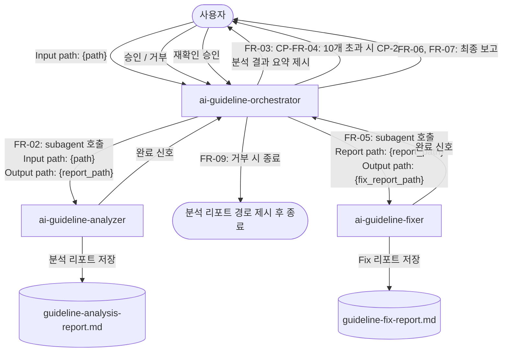
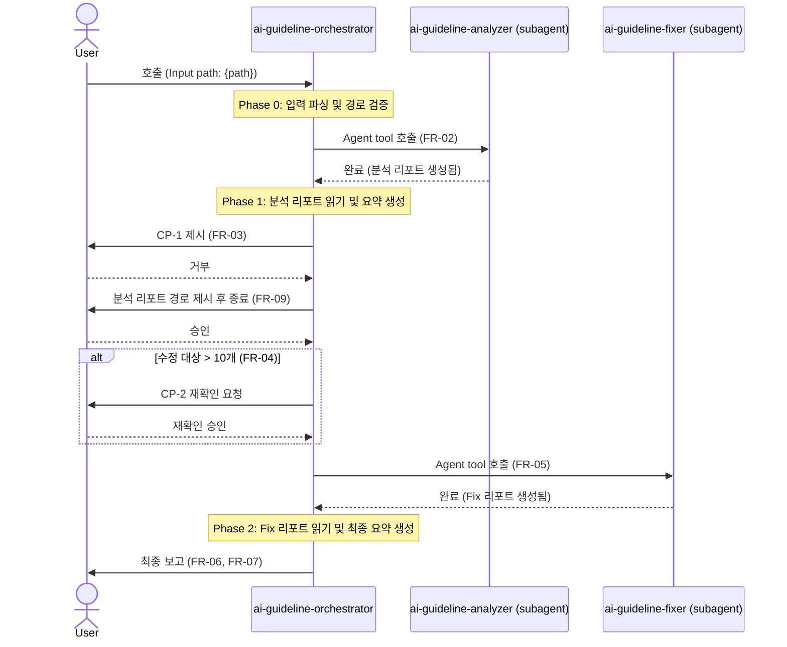

# AI Guideline Orchestrator — Design Document

**버전**: v1.0
**작성일**: 2026-04-01
**작성자**: software-develop-architect agent
**검토자**: (미지정)
**변경 이력**:
| 버전 | 날짜 | 내용 |
|------|------|------|
| v1.0 | 2026-04-01 | 최초 작성 |

---

## 1. 프로젝트 개요

### 목적

AI 지침 파일 분석(ai-guideline-analyzer) → 사용자 확인 → 수정(ai-guideline-fixer) 전체 파이프라인을 총괄하는 오케스트레이터 agent를 신규 개발한다.
현재 두 agent를 순서대로 수동으로 호출해야 하는 불편함을 없애고, 단일 진입점에서 전체 품질 개선 사이클을 완료할 수 있도록 한다.

### 범위

- 신규 파일: `.claude/agents/ai-guideline-orchestrator.md`
- 의존 파일(수정 없음): `.claude/agents/ai-guideline-analyzer.md`, `.claude/agents/ai-guideline-fixer.md`

### 용어 정의

| 용어 | 정의 |
|------|------|
| 분석 agent | `ai-guideline-analyzer` — 지침 파일 품질 점수 산출 |
| 수정 agent | `ai-guideline-fixer` — 분석 리포트 기반 자동 수정 |
| 분석 리포트 | 분석 agent가 저장하는 `guideline-analysis-report.md` |
| Fix 리포트 | 수정 agent가 저장하는 `guideline-fix-report.md` |
| 확인 지점 (CP) | 오케스트레이터가 사용자 응답을 기다리는 대화 중단 지점 |

---

## 2. 이해관계자 및 역할

| 이해관계자 | 역할 |
|------------|------|
| 개발자/운영자 | 오케스트레이터 호출, 확인 지점에서 진행 여부 결정 |
| 분석 agent | 파일 탐색 → 점수 산출 → 분석 리포트 저장 |
| 수정 agent | 분석 리포트 파싱 → 원본 파일 수정 → Fix 리포트 저장 |

---

## 3. 범위 경계 (Scope Boundary)

- 이 시스템은 **분석 agent 또는 수정 agent의 내부 로직을 수정하지 않는다**.
- 이 시스템은 **분석·수정 결과의 정확성을 보증하지 않는다** (각 agent의 책임).
- 이 시스템은 **UI를 제공하지 않는다** — 모든 상호작용은 Claude Code 대화 채널을 통한다.
- 이 시스템은 **단일 프로젝트 경로만 처리한다** — 복수 경로 동시 처리는 지원하지 않는다.
- 이 시스템은 **다른 agent의 subagent로 사용되는 것을 지원하지 않는다** — 사용자가 직접 호출하는 첫 번째 agent이어야 한다.

---

## 4. 요구사항 정의

### 기능 요구사항 (FR)

| ID | 요구사항 |
|----|----------|
| FR-01 | 사용자로부터 분석 대상 프로젝트 경로를 입력받아야 한다. |
| FR-02 | 분석 agent를 subagent로 호출하고 분석 리포트 파일이 생성될 때까지 대기해야 한다. |
| FR-03 | 분석 리포트 생성 후 분석 결과를 요약하여 사용자에게 제시하고, 수정 진행 여부를 반드시 물어야 한다 (CP-1). |
| FR-04 | 수정 대상 파일 수가 10개를 초과하는 경우 수정 범위 경고를 추가로 표시하고 재확인을 요청해야 한다 (CP-2). |
| FR-05 | 사용자 승인 후 수정 agent를 subagent로 호출하고 Fix 리포트 파일이 생성될 때까지 대기해야 한다. |
| FR-06 | 수정 완료 후 Fix 리포트 내용을 요약하여 사용자에게 최종 보고해야 한다. |
| FR-07 | 최종 보고에는 분석 리포트 경로, Fix 리포트 경로, 파이프라인 실행 요약(분석 파일 수 / 수정 파일 수 / 건너뛴 파일 수)을 포함해야 한다. |
| FR-08 | 분석 agent 또는 수정 agent 호출 실패 시 오류 내용을 사용자에게 알리고 파이프라인을 중단해야 한다. |
| FR-09 | 사용자가 수정 진행을 거부한 경우 분석 리포트 경로만 제시하고 정상 종료해야 한다. |

### 비기능 요구사항 (NFR)

| ID | 요구사항 |
|----|----------|
| NFR-01 | 확인 지점(CP-1, CP-2)에서 사용자 응답 없이 수정 agent를 자동 호출하지 않는다. |
| NFR-02 | 분석 agent와 수정 agent의 원본 파일을 수정하지 않는다. |
| NFR-03 | 도구 목록은 최소 권한 원칙으로 제한한다 (Read, Glob, Agent). |

---

## 5. 시스템 아키텍처

### 아키텍처 결정: 오케스트레이터 호출 방식

```
#### Architecture Decision: 오케스트레이터 호출 방식
| 항목            | Approach A: 직접 호출 agent  | Approach B: command 파일    | Approach C: 중첩 subagent   |
|-----------------|------------------------------|-----------------------------|------------------------------|
| 개요            | 사용자가 agent를 직접 호출   | skill/command 파일로 구현    | 다른 agent의 subagent로 실행 |
| 장점            | 사용자 확인 지점 구현 가능   | Claude Code 표준 진입점      | 파이프라인 자동화 가능        |
| 단점            | 호출 방식 명시 필요           | 확인 지점 구현 복잡          | 사용자 확인 지점 구현 불가   |
| 이 프로젝트 적합성 | 높음 — 확인 지점이 핵심 요구사항 | 중간 — 변환 비용 있음       | 낮음 — CP 요구사항 위반       |

→ **Selected: Approach A** — 확인 지점(CP-1, CP-2)이 필수 요구사항이므로 사용자가 직접 호출하는 agent로 구현한다.
```

### 전체 시스템 다이어그램



### 데이터 흐름



---

## 6. 컴포넌트 설계

### 6-1. 오케스트레이터 agent 파일 구조 (FR-01 ~ FR-09, NFR-01 ~ NFR-03)

**파일 경로**: `.claude/agents/ai-guideline-orchestrator.md`

**frontmatter**:

```yaml
---
name: ai-guideline-orchestrator
description: >
  AI 지침 파일 분석 → 수정 전체 파이프라인 오케스트레이터.
  ai-guideline-analyzer로 분석 후 사용자 확인을 받고, 승인 시 ai-guideline-fixer로 자동 수정한다.
  Invocation: "Use agent ai-guideline-orchestrator to analyze and fix AI guideline files. Input path: {path}"
model: sonnet
tools: Read, Glob, Agent
---
```

> 💡 [Assumption] AskUserQuestion 도구를 tools 목록에 포함하지 않는다. 오케스트레이터는 사용자가 직접 호출하는 첫 번째 agent이므로, 사용자 확인 지점(CP)은 agent가 대화 채널에 텍스트를 출력한 뒤 사용자 응답을 기다리는 자연스러운 중단(pause)으로 구현한다. 이 방식은 기존 ai-guideline-analyzer / ai-guideline-fixer와 동일한 패턴이다.

### 6-2. 실행 구조 (Phase)

```
Phase 0 → Phase 1 → CP-1 → (Phase 2) → CP-2? → Phase 3 → Phase 4
입력 파싱  분석 실행  사용자 확인  수정 실행  (조건부)  Fix 보고  최종 출력
```

#### Phase 0 — 입력 파싱 및 경로 검증 (FR-01)

- 입력에서 `Input path` 추출; 없으면 현재 디렉토리(`.`) 사용
- 분석 리포트 저장 경로 계산:
  - `{input_path}/guideline-analysis-report.md`
- Fix 리포트 저장 경로 계산:
  - `{input_path}/guideline-fix-report.md`
- Glob으로 `{input_path}` 존재 여부 확인
  - 없으면: `"오류: {path} 경로를 찾을 수 없습니다."` 출력 후 중단

#### Phase 1 — 분석 agent 호출 및 결과 수집 (FR-02, FR-03)

1. Agent tool을 사용하여 ai-guideline-analyzer subagent 호출:
   ```
   Use agent ai-guideline-analyzer to analyze AI guideline files.
   Input path: {input_path}
   Output path: {analysis_report_path}
   ```
2. 호출 완료 후 Read tool로 `{analysis_report_path}` 읽기
   - 파일 없으면: `"오류: 분석 리포트를 찾을 수 없습니다. ({analysis_report_path})"` 출력 후 중단 (FR-08)
3. 분석 결과 요약 파싱:
   - 분석된 파일 수
   - 평균/최고/최저 점수
   - 수정 대상 파일 수 (Total Score < 100점 파일 수)
4. **CP-1 출력** (FR-03):
   ```
   ## 분석 결과 요약
   - 분석된 파일: {M}개
   - 평균 점수: {avg}/100 | 최고: {max}/100 | 최저: {min}/100
   - 수정 대상 파일: {fix_count}개 (점수가 100점 미만인 파일)
   - 분석 리포트: {analysis_report_path}

   수정을 진행하시겠습니까? (예/아니오)
   ```
5. 사용자 응답 대기
   - "아니오" / "no" / "n" 계열 응답 → FR-09 처리 후 종료
   - 그 외 → Phase 2 진행

#### Phase 2 — 수정 범위 초과 확인 (FR-04, 조건부)

- `{fix_count}` > 10인 경우에만 실행:
  ```
  ## 수정 범위 경고
  수정 대상 파일이 {fix_count}개입니다 (10개 초과).
  수정 범위가 예상보다 클 수 있습니다.

  계속 진행하시겠습니까? (예/아니오)
  ```
- 사용자 응답 대기
  - "아니오" → FR-09 처리 후 종료
  - "예" → Phase 3 진행

#### Phase 3 — 수정 agent 호출 및 결과 수집 (FR-05, FR-06)

1. Agent tool을 사용하여 ai-guideline-fixer subagent 호출:
   ```
   Fix AI guideline files based on analysis report.
   Report path: {analysis_report_path}
   Output path: {fix_report_path}
   ```
2. 호출 완료 후 Read tool로 `{fix_report_path}` 읽기
   - 파일 없으면: `"오류: Fix 리포트를 찾을 수 없습니다. ({fix_report_path})"` 출력 후 중단 (FR-08)
3. Fix 결과 파싱:
   - 수정된 파일 수
   - 수정된 항목 수
   - 수정하지 못한 항목 수 (skip 항목)

#### Phase 4 — 최종 보고 출력 (FR-07)

```
## 파이프라인 완료

### 실행 요약
| 항목 | 값 |
|------|-----|
| 분석된 파일 수 | {M}개 |
| 수정된 파일 수 | {fixed_files}개 |
| 수정된 항목 수 | {fixed_items}개 |
| 건너뛴 항목 수 | {skipped_items}개 |

### 출력 파일
- 분석 리포트: {analysis_report_path}
- Fix 리포트: {fix_report_path}
```

---

## 7. 인터페이스 설계 (CLI)

### 호출 형식

```
Use agent ai-guideline-orchestrator to analyze and fix AI guideline files. Input path: {path}
```

| 파라미터 | 필수 | 기본값 | 설명 |
|---------|------|--------|------|
| Input path | N | `.` (현재 디렉토리) | 분석할 프로젝트 경로 |

### 생성 파일

| 파일 | 경로 | 생성 주체 |
|------|------|----------|
| 분석 리포트 | `{input_path}/guideline-analysis-report.md` | ai-guideline-analyzer |
| Fix 리포트 | `{input_path}/guideline-fix-report.md` | ai-guideline-fixer |

### 확인 지점 입력 형식

| CP | 프롬프트 | 허용 응답 |
|----|----------|----------|
| CP-1 | 수정을 진행하시겠습니까? | 예/아니오, yes/no, y/n (대소문자 무관) |
| CP-2 | 계속 진행하시겠습니까? (10개 초과 시) | 예/아니오, yes/no, y/n (대소문자 무관) |

---

## 8. 예외 처리

| 상황 | 처리 | 관련 FR |
|------|------|---------|
| `input_path` 존재하지 않음 | 오류 메시지 출력 후 중단 | FR-01 |
| 분석 리포트 생성 실패 | 오류 메시지 출력 후 중단 | FR-08 |
| Fix 리포트 생성 실패 | 오류 메시지 출력 후 중단 | FR-08 |
| 사용자가 수정 거부 (CP-1 또는 CP-2) | 분석 리포트 경로 출력 후 정상 종료 | FR-09 |
| 분석 agent 내부 오류 | agent 오류 메시지를 사용자에게 전달 후 중단 | FR-08 |
| 수정 agent 내부 오류 | agent 오류 메시지를 사용자에게 전달 후 중단 | FR-08 |

---

## 9. 개발 단계 및 우선순위

### Phase A — 핵심 파이프라인 (필수)

| # | 작업 | 완료 기준 |
|---|------|----------|
| A-1 | agent 파일 생성 (frontmatter + Phase 0~4 본문) | `.claude/agents/ai-guideline-orchestrator.md` 파일 존재, frontmatter 필드 누락 없음 |
| A-2 | Phase 0: 입력 파싱 및 경로 검증 구현 | 잘못된 경로 입력 시 오류 메시지 출력 후 중단 확인 |
| A-3 | Phase 1: 분석 agent 호출 및 CP-1 구현 | 분석 리포트 생성 후 CP-1 텍스트 출력, 사용자 응답 수신 확인 |
| A-4 | Phase 3: 수정 agent 호출 및 결과 수집 구현 | Fix 리포트 생성 후 Phase 4 최종 보고 출력 확인 |

### Phase B — 보완 기능 (권장)

| # | 작업 | 완료 기준 |
|---|------|----------|
| B-1 | Phase 2: 10개 초과 시 CP-2 재확인 구현 | 수정 대상 11개 이상인 케이스에서 CP-2 프롬프트 출력 확인 |
| B-2 | FR-09: 사용자 거부 시 정상 종료 처리 | CP-1에서 "아니오" 입력 시 분석 리포트 경로만 출력하고 종료 확인 |
| B-3 | Self-Verification 섹션 추가 | 체크리스트 5개 이상 포함 |

---

## 10. 리스크 및 제약

| 리스크 | 영향 | 대응 |
|--------|------|------|
| 분석 agent / 수정 agent API 변경 | 호출 프롬프트 형식 불일치 → 파이프라인 실패 | 각 agent의 Invocation 형식을 명시적으로 고정하고, agent 변경 시 오케스트레이터도 동시 검토 |
| 대용량 분석 리포트 (100개 이상 파일) | Phase 1 Read 시 컨텍스트 과부하 | 분석 리포트 헤더와 요약 섹션만 읽도록 Read의 limit 파라미터 사용 (limit: 100) |
| 사용자가 중간에 세션을 종료한 경우 | CP-1 이후 응답 없이 종료 → 수정 agent 미호출 | 오케스트레이터는 stateless이므로 다시 호출 시 Phase 0부터 재시작 |

> ⚠️ [Review Needed] 분석 리포트 파싱(파일 수, 평균 점수 등)은 리포트 형식이 고정되어 있다고 가정한다. ai-guideline-analyzer 리포트 형식이 변경되면 파싱 로직도 함께 수정해야 한다.

---

## 11. 자기 검증 체크리스트

| # | 체크 항목 | 결과 |
|---|-----------|------|
| 1 | 모든 완료 기준이 측정 가능한가? | ✅ 파일 존재 여부, 출력 텍스트 포함 여부로 검증 가능 |
| 2 | 참조 파일이 실제로 존재하는가? | ✅ `ai-guideline-analyzer.md`, `ai-guideline-fixer.md` 존재 확인 |
| 3 | 기존 코드와의 충돌 가능성 검토 | ✅ 신규 파일 생성, 기존 agent 파일 수정 없음 |
| 4 | 인터페이스 정의가 즉시 구현 가능한가? | ✅ frontmatter, Phase 구조, 호출 프롬프트 형식 모두 명시 |
| 5 | 예외 케이스 누락 여부 | ✅ 경로 오류, agent 실패, 사용자 거부 모두 처리 |
| 6 | FR/NFR 태그 연결 | ✅ 각 Phase에 FR 태그 명시 |
| 7 | Mermaid 다이어그램 포함 | ✅ 전체 다이어그램 + 시퀀스 다이어그램 포함 |
